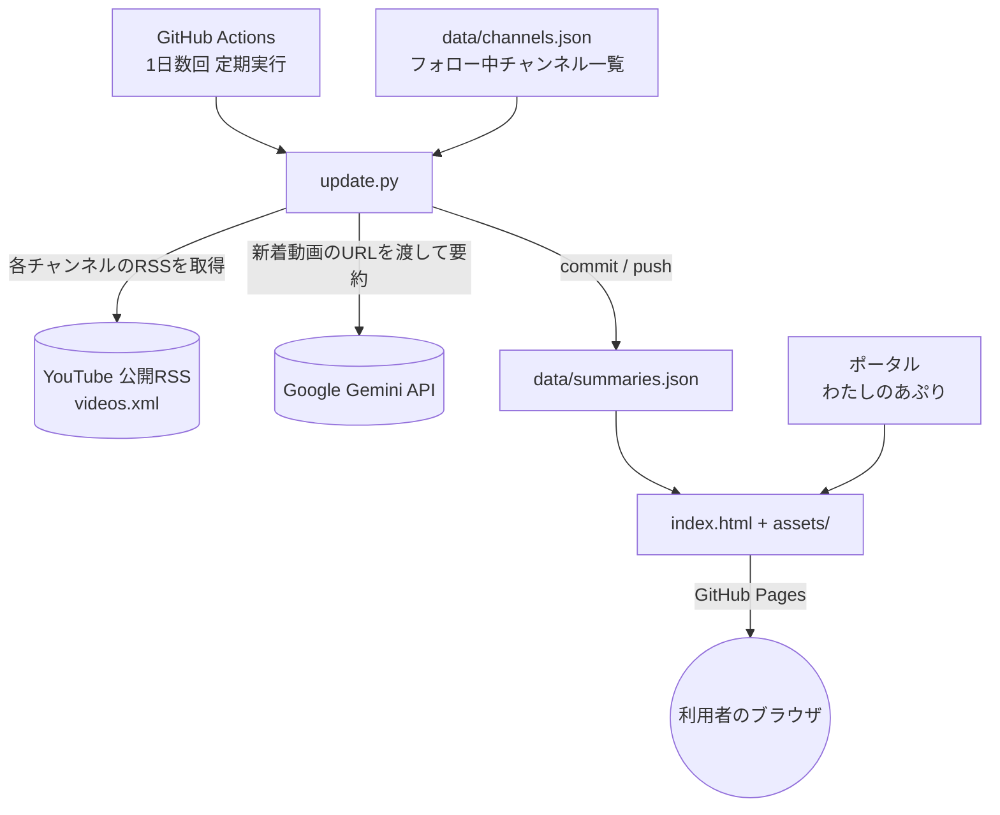
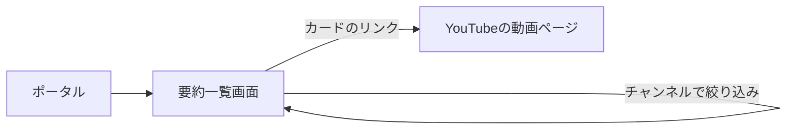

# 機能設計書 — ユーチューブ要約

## システム構成



- バックエンドサーバーは存在しない。閲覧側の動的処理はすべてブラウザ内の JavaScript。
- 定期バッチ（GitHub Actions）だけがサーバーサイド相当の処理を担う。
- Gemini API キーは GitHub の Secrets に保管し、Actions の中だけで使う。ブラウザからは呼ばない。

## 新着検知のしくみ

- YouTube は各チャンネルの最新動画を **公開RSSフィード** で配信している
  （`https://www.youtube.com/feeds/videos.xml?channel_id=UCxxxx`）。ログイン・APIキー不要。
- `channel_id`（`UC` で始まるID）は初回セットアップ時に @名 から一度だけ調べて `channels.json` に保存する。
- 各RSSには最新15件程度の動画（ID・タイトル・公開日時・サムネイル）が入っている。
- 「まだ要約していない」かつ「公開からN日以内（初期値5日）」の動画を新着とみなす。

## データモデル

### data/channels.json（配列・ほぼ固定。追加削除は手動編集）
| フィールド | 型 | 説明 |
|---|---|---|
| handle | string | `@senxotimes` などの @名（人が見て分かる用） |
| channel_id | string | `UC` で始まるチャンネルID（RSS取得のキー） |
| name | string | 表示用チャンネル名 |

### data/summaries.json（自動生成）
| フィールド | 型 | 説明 |
|---|---|---|
| updated_at | string | 生成時刻（ISO8601, JST） |
| items[] | array | 要約済み動画（新しい順） |
| items[].video_id | string | 動画ID |
| items[].url | string | `https://www.youtube.com/watch?v=<video_id>` |
| items[].title | string | 動画タイトル |
| items[].channel | string | チャンネル名 |
| items[].channel_id | string | チャンネルID |
| items[].published_at | string | 動画の公開日時（ISO8601） |
| items[].thumbnail | string | サムネイル画像URL |
| items[].summary | string | 日本語の要約（3〜6行程度のプレーンテキスト） |
| items[].summarized_at | string | 要約を生成した時刻 |
| items[].status | string | `"ok"` = 要約成功 / `"failed"` = 失敗（次回再試行） |

- `items` は新しい順で最大200件まで保持し、古いものは切り捨てる。

## 画面設計

単一画面。ページ遷移なし。



### 要約一覧画面（index.html）
- ヘッダー: アプリ名 / 最終更新時刻 / 「要約はAIが自動生成したもので、正確性は保証しません」の注意書き。
- 絞り込み: チャンネル名のプルダウン（「すべて」＋各チャンネル）。
- 本体: 動画カードを新しい順に縦に並べる。
  - 左（または上）にサムネイル画像。
  - タイトル（YouTubeへのリンク）。
  - チャンネル名 ・ 公開日時（「2時間前」「9/1」などの相対／短縮表記）。
  - 要約本文。
  - `status` が `failed` の場合は「要約準備中」と表示。
- 該当なしのとき: 「まだ新しい動画の要約はありません」。

### ワイヤフレーム（イメージ）
```
┌───────────────────────────────────────┐
│ ユーチューブ要約         最終更新 9/2 18:20 │
│ ⚠ 要約はAIが自動生成。正確性は保証しません   │
│ [ チャンネル: すべて ▼ ]                   │
├───────────────────────────────────────┤
│ ┌────┐  動画タイトル（リンク）              │
│ │サムネ│  チャンネル名 ・ 3時間前            │
│ └────┘  ・要点1 …                        │
│         ・要点2 …                        │
├───────────────────────────────────────┤
│ ┌────┐  次の動画タイトル                   │
│ ...                                     │
└───────────────────────────────────────┘
```

## コンポーネント設計（assets/app.js）
| 関数 | 役割 |
|---|---|
| `loadData()` | `data/summaries.json` を取得して `state.items` に格納 |
| `renderFilter()` | items からチャンネル一覧を作りプルダウンを生成 |
| `render()` | 選択中チャンネルで絞り込み、カードを新しい順に描画 |
| `formatWhen(iso)` | 公開日時を「◯時間前 / M/D」表記に変換 |
| `setupControls()` | プルダウン変更・テーマ変更のイベント登録 |

## 定期バッチ（scripts/update.py）

1. `data/channels.json` と既存の `data/summaries.json` を読み込む。
2. 各チャンネルの RSS（`videos.xml?channel_id=...`）を取得し、動画エントリを解析する。
   - 取得失敗したチャンネルはスキップ（そのまま次へ）。
3. 「未要約」かつ「公開5日以内」の動画を集める（1チャンネル最大4本／回）。公開が古い順に並べる。
4. 1回の実行で要約するのは最大4件まで（無料枠を超えないため。残りは次回実行で処理）。
5. 各動画について Gemini API に **動画のYouTube URL** を渡し、日本語要約を生成する。
   - プロンプト例:「この動画の内容を、日本語で結論から先に、箇条書き3〜6点で要約してください。
     専門用語には簡単な補足を付けてください。」
   - 成功 → `status: "ok"`。失敗 → `status: "failed"` で記録し、次回実行で再試行。
   - 動画1本ごとに約45秒待つ（無料枠の「1分あたり入力量」上限対策）。
   - クォータ超過を返したら、指定秒数だけ待って1回再試行。続く場合はその実行を打ち切り残りは次回へ。
6. 新しい要約を `items` の先頭に追加し、新しい順で最大200件に切り詰める。
7. `data/summaries.json` を UTF-8 で書き出す。
8. 変更があれば commit して push する。

## エラー時の振る舞い
| 事象 | 挙動 |
|---|---|
| 一部チャンネルのRSS取得失敗 | そのチャンネルのみスキップ。次回実行で再取得 |
| ある動画の要約失敗 | `status: "failed"` で保存。次回実行で再試行（画面は「要約準備中」） |
| Gemini のクォータ超過 | 指定秒数待って1回再試行。なお続けば途中終了し翌回以降に持ち越し |
| Actions 実行自体の失敗 | 前回の `summaries.json` のまま（画面は古い一覧で動作） |
| ブラウザで `summaries.json` を読めない | 画面に「読み込めませんでした」を表示 |
